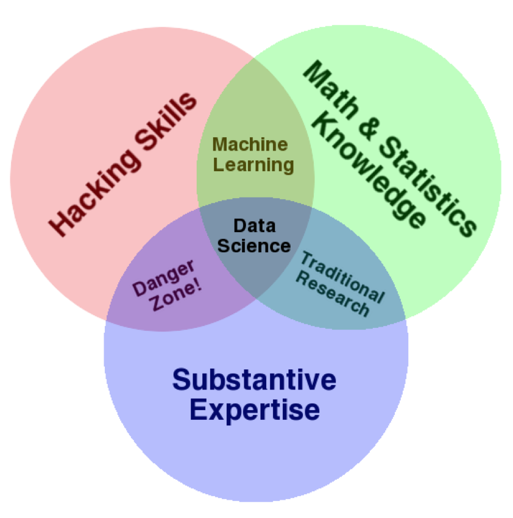

## Analiza podatkov

- Potrebe po *podatkovnih analitikih* (podatkovni inženir, ang. data scientist) strmo naraščajo
```{r echo=FALSE, out.width='60%'}

```

## Kdo rabi podatkovne analitike?

- Finančni sektor (banke, zavarovalnice, fintech, ...)
- Nova hitro rastoča start-up podjetja temelječa na informacijskih rešitvah: 
    - deljena ekonomija: Uber, Airbnb, ...
    - spletni marketing: Google, Facebook, ...
    - internet stvari, velika podatkovja, mobilne aplikacije, veriženje blokov, ...
- Podatkovno-krmiljena podjetja (ang. data driven), digitalna transformacija, ...
- AI - umetna inteligenca, strojno učenje

## Kaj delajo podatkovni analitiki?

- Postavljajo cilje, izzive, hipoteze
- Definirajo vrste potrebnih podatkov
- Ugotavljajo, kakšne podatke lahko dobijo
- Pridobivajo podatke
- Čistijo podatke
- Izvajajo raziskovalne analizo (ang. exploratory analysis)
- Sestavljajo predikcijske modele
- Interpretirajo rezultate
- Kritično vrednotijo rezultate
- Iz rezultatov potegnejo zaključke in jih ustrezno zapišejo
- Poskrbijo za ponovljivost analiz (dokumentacija, koda, verzije, ...)
- Objavijo rezultate in jih distribuirajo

## Kompetence podatkovnih analitikov

- Dobro poznavanje domene raziskav
- Dobro poznavanje matematike in statistike
- Dobro poznavanje programerskih veščin (t.i. hackerski duh)
- 
```{r echo=FALSE, out.width='60%'}

```
- http://drewconway.com

## Orodja in ponovljive analize

- Github (github.com), GIT - shranjevanje verzij kode in podatkov
- R - programski jezik
- RStudio - razvojno okolje, programiranje, dokumentiranje
    - različni paketi v R za analizo in vizualizacijo podatkov
    - RMarkdown - dokumentiranje in izdelava prezentacij
    - Shiny - izdelava interaktivnih aplikacij

## Programski jezik R

- Odprtokodna rešitev, prosto dostopen
- Ponuja obsežno množico orodij za podporo vsem nalogam podatkovne analize
- RStudio - eno izmed najboljših razvojnih okolij za podatkovno analitiko
- Velika skupnost, ki ga podpira
- Dober sistem paketov
- Alternative: npr. Python in knjižnica Pandas.
- Lahko si ga predstavljamo kot programsko varianto orodij za obdelavo razpredelnic, kot je Excel

## Namestitev R + RStudio

- Osnovno okolje (RConsole): https://www.r-project.org/
- RStudio: https://www.rstudio.com/
    - konzola z ukazno vrstico (podobno kot IDLE v Pyhtonu)
    - projektno okolje (pregled datotek, naloženih spremenljiv, upravljanje paketov, ...)
  
## Osnovni podatkovni tipi {.build}

- Vsak podatkovni objekt, ki ga lahko priredimo v spremenljivko ima tip (razred)

- ```character``` - nizi (```"To je besedilo", 'to je niz'```)
- ```numeric``` - realna števila (```1.2, -3.55, 1.1e-3```)
- ```integer``` - cela števila (```1, -20```)
- ```complex``` - kompleksna števila (```2 + 3i```)
- ```logical``` - logične vrednosti (```TRUE```, ```FALSE```)

## Sestavljeni podatkovni tipi {.build}

- ```vector``` - vektorji so tabele (tabelarični seznami) objektov istega osnovnega tipa
- Minimalni uporabni objekti so vektorji
- Tudi če vnesemo število ```1```, je to vektor tipa ```numeric``` dolžine 1
- Izpeljanke tipa ```vector```
    - ```matrix``` - matrike, vektorji s podanim razbitjem po vrsticah
    - ```array``` - večdimenzionalne matrike/tabele
    - ```factor``` - vektorji kategoričnih spremenljivk (omejen nabor vrednosti)
    
## Sestavljeni podatkovni tipi {.build}

- ```list``` - seznami lahko vsebujejo objekte različnih podatkovnih tipov
- ```data.frame``` - razpredelnice - dvo-dimenzionalne podatkovne tabele s poimenovanimi stolpci kot vektorji (standardna oblika podatkov za izvajanje analiz)

## Osnovni objekti in izpis {.build}

- 
```r
> a <- 1     # <- prireditveni operator, lahko uporabimo tudi '='
> class(a)   # izpis tipa objekta
[1] "numeric"
```
- 
```r
> b = 1L     # eksplicitna zahteva vnosa celega števila
> class(b)
[1] "integer"
```
- 
```r
> niz <- "To je niz"  # Niz navedemo v dvojnih navednicah
```
- 
```r
> niz                 # Avtomatični izpis vsebine
[1] "To je niz"
```
- 
```r
> print(niz)          # Zahtevan izpis vsebine
[1] "To je niz"
```

## Prirejanje in spremenljivke {.smaller .build}

```r
> TRUE -> c     # Prirejamo lahko tudi v drugo stran
> class(c)     
[1] "logical"
```
```r
> d <- x <- 2 + 3i   # Prirejamo lahko tudi zaporedoma
> class(x)
[1] "complex"
> d
[1] 2+3i
```
```r
> rm(d)   # Brisanje spremenljivk
> d
Error: object 'd' not found
```
```r
> 2*(a <- 1.23)   # Prireditev v oklepajih vrne rezultat
[1] 2.46
```
```r
> A             # R loči velike in male črke  
Error: object 'A' not found
```

## Prirejanje in spremenljivke {.build}

- imena spremenljivk: zaporedja črk, števk, pik in podčrtajev
- rezervirane besede (npr. ```if```, ```while```, ```NULL```, ```Inf``` ...)
- operatorji prirejanja (```<-```, ```->```, ```=```)
- prirejanje je imenovanje objektov v danem okolju (environment)
- ```objects()``` in ```ls()``` za izpis objektov po imenih v okolju (izpis spremenljivk)
- ```rm(...)``` brisanje poimenovanj in objektov (spremenljivk) v okolju

## Vektorji {.build}

- V zgornjih primerih je bil rezultat vedno podan kot vektor (oblike ```[1] ...```)
```r
> 10
[1] 10
```
```r
> (v <- 1:20)   # prireditev z izpisom
 [1]  1  2  3  4  5  6  7  8  9 10 11 12 13 14 15 16
[17] 17 18 19 20
```

## Vektorji {.build}

- Z operatorjem dvopičje (```:```) ustvarimo vektor zaporednih števil
- Z zapisom v oklepajih dosežemo prireditev in izpis
- Izpis:
    - V oglatih oklepajih je naveden indeks začetnega člena v vrstici
    - Indeksiranje (številčenje) poteka od 1 dalje (v Pythonu od 0 dalje)
```r
> 5:2
[1] 5 4 3 2
```

## Vektorji {.build}
- S funkcijo ```c(...)``` sestavljamo vektorje (ang. concatenate)
```r
> c(10, 12, 5)   # konstrukcija vektorja iz števil
[1] 10 12  5
```
```r
> v <- c(2, 3, 4)
> c(1, v, 5)   # združevanje vektorjev
[1] 10 12  5
```
- eno število (en element) je že vektor

## Tipi in pretvarjanje {.smaller .build}

- Osnovni podatkovni tipi so vedno zapakirani v vektorje
```r
> x <- 1:5
> class(x)
[1] "integer"
> is.numeric(x)  # ali je 'x' tipa 'numeric'?
[1] TRUE
> is.character(x) # ali je 'x' tipa 'character'?
[1] FALSE
```
- Funkcije oblike ```is.tip(...)``` služijo za preverjanje tipa
- Pozor: pika je sestavni del imena funkcije (ni operator kot pri Pyhtonu)
```r
> as.logical(x)    # pretvorba v vektor logičnih vrednosti
[1] TRUE TRUE TRUE TRUE TRUE
> as.character(x)   # pretvorba v vektor nizov
[1] "1" "2" "3" "4" "5"
```

## Tipi in pretvarjanje { .build}

- Funkcije oblike ```as.tip(...)``` služijo za pretvarjanje med tipi
- Implicitne pretvorbe se zgodijo, ko pri ustvarjanju vektorjev mešamo tipe in je možno vse elemente pretvoriti v enoten tip
```r
> c(1.3, "a")  # implicitna pretvorba v vektor nizov
[1] "1.3" "a"  
> c(TRUE, 5)   # implicitna pretvorba v vektor števil
[1] 1 5
> c("a", "TRUE")    # implicitna pretvorba v vektor nizov
[1] "a"    "TRUE"
```

## Tipi in pretvarjanje {.build}

- Nesmiselne pretvorbe vrnejo ```NA``` (oznaka za manjkajočo vrednost)
```r
> as.numeric(c("a", "b"))   
[1] NA NA
Warning message:
NAs introduced by coercion 
> as.logical(c("a","b"))
[1] NA NA
```

## Ustvarjanje vektorjev {.build}

- Funkcija ```vector(...)```
```r
> vector("numeric", length=10)
 [1] 0 0 0 0 0 0 0 0 0 0
```
- Funkcije ```tip(...)```
```r
> integer(10)
 [1] 0 0 0 0 0 0 0 0 0 0
> character(5)
[1] "" "" "" "" ""
```

## Ustvarjanje vektorjev {.build}

- ```seq(n,m,k)``` - vektor z vrednostmi od ```n``` do ```m``` s korakom ```k```
```r
> seq(0.75, 1.4, 0.1)
[1] 0.75 0.85 0.95 1.05 1.15 1.25 1.35
```
- ```rep(v,k)``` - vektor s ```k``` ponovitvami vektorja ```v```
```r
> rep(c(1, 2, 3), 3)
[1] 1 2 3 1 2 3 1 2 3
```

## Logične vrednosti {.build}

- ```TRUE```, ```FALSE``` in ```NA```
- Operatorji negacija (```!```), konjunkcija (```&``` oz. ```&&```) ter disjunkcija (```|``` oz. ```||```)
```r
> !TRUE
[1] FALSE
> FALSE || TRUE
[1] TRUE
> NA | TRUE
[1] TRUE
```
- Primerjave vračajo logične vrednosti (```<```, ```>```, ```<=```, ```>=```, ```==```, ```!=```)
```r
> 1 != 2   # ali je 1 različno od 2
[1] TRUE
> 10 > 5.5  # ali je 10 strogo večje od 5.5
[1] TRUE
```

## Logične vrednosti {.build}

- Predikati oblike ```is.nekaj``` vračajo logične vrednosti
```r
> is.integer(1)    # ali je 1 celo število?
[1] FALSE
> is.finite(20)    # ali je 20 končna vrednost
[1] TRUE
> is.finite(Inf)    # 'Inf' predstavlja pozitivno neskončnost
[1] FALSE
```

## ```Inf``` in ```NaN``` {.build}

```r
> 1/0      # deljenje 1 z 0 vrne neskončnost
[1] Inf
```
```r
> 10/Inf   # deljenje z 0 vrne 0
[1] 0
```
```r
> Inf-Inf   # rezultat ni definiran (ni število)
[1] NaN
```
```r
> sqrt(-1)
[1] NaN
Warning message:
In sqrt(-1) : NaNs produced
```
```r
> 0/0
[1] NaN
```

## Operacije na vektorjih {.build}

- Klasične aritmetične operacije ```+```, ```-```, ```*```, ```/```, ```%%```, ...
- Krožno dopolnjevanje
```r
> c(1,2) + c(3,4)   # seštevanje po komponentah
[1] 4 6
```
```r
> 1:6 + c(1,2)  # drugi vektor je prekratek -> krožno dopolnjevanje
[1] 2 4 4 6 6 8
```
```r
> 1:10 %% 3     # operator 'ostanek', krožno dopolnjevenje enega elementa 
 [1] 1 2 0 1 2 0 1 2 0 1
```

## Operacije na vektorjih {.build}

```r
> 1:5 * c(2, 3) 
Warning message:
In 1:5 * c(2, 3) :
  longer object length is not a multiple of shorter object length
```
- Element na indeksu. Operator ```[[]]```
```r
> v <- c("a", "b", "c", "d", "e")
> v[[3]]    # element na mestu 3
[1] "c"
```
- PAZI: indeksi se v R štejejo od 1 dalje (ne od 0)!

## Operacije na vektorjih {.build}

- Podzaporedja. Operator ```[]```
```r
> v[c(3,4)]   # podzaporedje iz 3. in 4. člena
[1] "c" "d"
```
- Negativni indeksi povejo, katere člene odstranimo
```r
> v[c(-1,-5)]   # odstrani 1. in 5. člena
[1] "b" "c" "d"
```
- Logični indeksi (logične maske - TRUE - ostane, FALSE - odpade)
```r
> v[c(TRUE, FALSE)]   # lihi elementi (krožno dopolnjevanje, ki se lahko "ne izide")
[1] "a" "c" "e"
```


## Atributi {.build}

- Vektorju lahko nastavimo atribute
- Atributi se obnašajo podobno kot atributi pri objektno orientiranem programiranju
```r
> v <- 1:6
> attr(v, "nekaj") <- c(1,2)   # prirejanje atributa 'nekaj'
> attr(v, "drugi") <- "Drugi"
> v
[1] 1 2 3 4 5 6
attr(,"nekaj")
[1] 1 2
attr(,"drugi")
[1] "Drugi"
```

## Atributi {.build}

```r
> attributes(v)   # seznam atributov
$nekaj
[1] 1 2
$drugi
[1] "Drugi"
```
```r
> attributes(v)[[2]]   # drugi atribut iz seznama
[1] "Drugi"
```

## Atribut ```names``` {.build}

- Poseben atribut ```names``` - poimenovanje komponent
```r
> v <- c(a=1, b=2, 3)  # poimenovanje komponent vektorja
> v
a b   
1 2 3 
```
```r
> attributes(v)
$names
[1] "a" "b" "" 
```

## Atribut ```names``` {.build}

```r
> v <- c(10, 20)
> names(v) <- c("prvi", "drugi")
> v
 prvi drugi 
   10    20 
```
- Uporaba pri sklicu na komponente
```r
> v[["a"]]  # element poimenovan 'a'
[1] 1
```
```r
> v[c("a", "b")]   # podzaporedje dobljeno preko imen komponent
a b 
1 2 
```

## Faktorji {.build}

- Faktorji so vektorji z omejenim naborom vrednosti
- Uporabljajo se za kategorične spremenljivke (npr. spol M/Ž, krvna skupina, ...)
```r
> v <- c("a", "b", "b", "a")
> f <- factor(v)   # ustvarjanje faktorja iz nabora komponent vektorja
> f
[1] a b b a
Levels: a b
> class(f)
[1] "factor"
```

## Faktorji {.build}

- Reprezentacija:
```r
> capture.output(dput(factor(v)))
[1] "structure(c(1L, 2L, 2L, 1L), .Label = c(\"a\", \"b\"), class = \"factor\")"
```
```r
> f <- structure(c(1L, 2L, 2L, 1L), .Label = c("a", "b"), class = "factor")
> attributes(f)
$levels
[1] "a" "b"
$class
[1] "factor"
```

## Matrike {.build}

- Matrika je vektor z dodatnim atributom ```dim```
```r
> a <- matrix(1:6, ncol = 3, nrow = 2)
> a
         [,1] [,2] [,3]
[1,]    1    3    5
[2,]    2    4    6
```
```r
> attributes(a)
$dim
[1] 2 3
> class(a)
[1] "matrix"
```

## Matrike {.build}

```r
> v <- 1:6
> class(v)
[1] "integer"
> attr(v, "dim") <- c(2,3)  # pretvorba vektorja v matriko dimenzije 2 x 3
> v
         [,1] [,2] [,3]
[1,]    1    3    5
[2,]    2    4    6
> class(v)
[1] "matrix"
```
- Matriko lahko sestavimo tudi takole
```r
> a <- structure(1:6, dim=c(2,3))   # "surovo" sestavljanje matrike
> class(a)
[1] "matrix"
```

## Matrike in več dimenzionalne tabele {.build}

- Večdimenzionalna tabela
```r
> b <- array(1:12, c(2, 3, 2))      # večdimenzionalna tabela dimenzij 2x3x2
> b
, , 1
         [,1] [,2] [,3]
[1,]    1    3    5
[2,]    2    4    6
, , 2
         [,1] [,2] [,3]
[1,]    7    9   11
[2,]    8   10   12
> class(b)
[1] "array"
```

## Matrike in več dimenzionalne tabele {.smaller .build}

- Funkcija  ```dim(...)``` spreminja atribut  ```dim``` na vektorju
```r
> dim(b) <- c(2, 6)  # prerazporeditev 2x3x2 dim. tabele v 2x6 dim. matriko
> b
         [,1] [,2] [,3] [,4] [,5] [,6]
[1,]    1    3    5    7    9   11
[2,]    2    4    6    8   10   12
> class(b)
[1] "matrix"
```
- Razne dimenzije
```r
> length(b)    # dolžina vektorja
[1] 12
> nrow(b)      # število vrstic
[1] 2
> ncol(b)      # število stolpcev
[1] 6
> dim(b)       # vektor dimenzij
[1] 2 6
```

## Poimenovanja vrstic in stolpcev, indeksi {.build}

```r
> rownames(b) <- c(1,2)
> b
  [,1] [,2] [,3] [,4] [,5] [,6]
1    1    3    5    7    9   11
2    2    4    6    8   10   12
```
```r
> colnames(b) <- c("prvi", "drugi", "tretji", "četrti", "peti", "šesti")
> b
  prvi drugi tretji četrti peti šesti
1    1     3      5      7    9    11
2    2     4      6      8   10    12
> 
```

## Poimenovanja vrstic in stolpcev, indeksi {.build}

```r
> b[2,3] # Dostop do elementov na indeksih
[1] 6
```
- Vektorji, matrike, faktorji in večdimenzionalne tabele so vektorji z dodatnimi atributi, ki jih R in njegove funkcije ustrezno intepretirajo

## Seznami {.build}

- Zaporedja objektov različnih tipov (kot v Pythonu)
```r
> list("a", 1)
[[1]]
[1] "a"
[[2]]
[1] 1
```

## Seznami {.build}

- Elementi seznama so lahko poimenovani
```r
> seznam <- list(prvi="a", drugi=1)
$prvi
[1] "a"
$drugi
[1] 1
```
- Do elementov dostopamo z dvojnim oglatim oklepajem ali preko imena
```r
> seznam[[1]]
[1] "a"
> seznam$drugi
[1] 1
```

## Razpredelnice {.build}

- Uporabljajo se za shranjevanje tabelaričnih podatkov (npr. kot v Excelu)
- So poseben primer seznama - vsak element seznama je poimenovan stolpec
```r
> placila <- data.frame(Ime=c("Janez", "Anja", "Francelj"), Izplacilo=c(100, 120, 90))
> placila
       Ime Izplacilo
1    Janez       100
2     Anja       120
3 Francelj        90
```
- Poseben atribut ```row.names```

## Razpredelnice {.build}

```r
> row.names(placila) <- c("prvo", "drugo", "tretje")
> placila
            Ime Izplacilo
prvo      Janez       100
drugo      Anja       120
tretje Francelj        90
```
- Preberemo jih lahko iz npr. formata CSV, ki ga lahko dobimo iz Excela (funkcije ```read.csv(...)```, ```read.csv2(...)```, ```read.table(...)```)

## Sestavljeni izrazi {.build}

- Sestavljen izraz je zaporedje izrazov ločenih s podpičji v zavitih oklepajih, ki se izvedejo
- Rezultat zaporedja je vrednost zadnjega izraza (če ni za njim podpičja)
```r
> {a <- 1; b <- 2 + a; a + b}
[1] 4
```
- Sestavljene izraze uporabljamo podobno kot pri Pythonu zamikanje (bloki), tipično pri krmilnih stavkih, zankah in funkcijah

## Pogojni stavek (```if```) {.build}

```r
> a <- 1
> if (a > 0) print("večji") 
[1] "večji"
> if (a == 5) print("Je pet.") else print("Ni pet") 
[1] "Ni pet"
```
- Pogoj je vedno v oklepaju za ```if```, ```else``` pa ni obvezen
- Namesto zamikanja uporabljamo bloke
```r
> a <- 1
> if (a < 3) {a <- a + 1; a <- a + 1; print("Morda pa je zdaj čez tri ...")} 
[1] "Morda pa je zdaj čez tri ..."
```

## Pogojni stavek (```if```) {.build}

- Pri R zamikanje ni pomembno - imamo sestavljene izraze (oz. bloke), ki jih lahko lepo razpišemo čez več vrstic.
- Vseeno zamikamo, da je koda bolj pregledna. Npr. v urejevalniku zapišemo:
-
```r
if (a < 3) {
        a <- a + 1; 
        a <- a + 1;   
        print("Morda pa je zdaj čez tri ...")
} 
```

## Zanki ```while``` in ```repeat``` {.build}

- Zanka ```while``` se obnaša enako kot v Pythonu
-
```r
> i <- 0
> while (i < 3) {print(i); i <- i + 1}
[1] 0
[1] 1
[1] 2
```
- Zanka ```repeat``` je neskončna zanka. Prekinemo jo lahko z ```break```
-
```r
> i <- 0
> repeat {print(i); i <- i + 1; if (i > 2) break}
[1] 0
[1] 1
[1] 2
```

## Funkcije {.build}

- Sestavimo jih na naslednji način
```r
> f <- function(a) {a*a}
> f(3)
[1] 9
```
- Primer rekurzije
```r
> gcd <- function(a, b) {if(b == 0) abs(a) else gcd(b, a %% b)}
> gcd(12, 15)
[1] 3
```
- V funkciji lahko s klicem funkcije ```return(...)``` eksplicitno vrnemo vrednost in zaključimo funkcijo
```r
gcd <- function(a, b) { if(b == 0) return(abs(a)) else return(gcd(b, a %% b))}
> gcd(12, 15)
[1] 3
```


## Funkcije {.smaller .build}

- Definicije lastnih operatorjev
```r
> "%m%" <- function(a,b) min(a,b)
> 3 %m% 4
[1] 3
```
- Podobno kot pri Pythonu so spremenljivke definirane v funkciji lokalne in so definirane samo v lokalnem okolju funkcije
- Zunanje spremenljivke (globalno okolje) lahko beremo v funkciji, v njih pa lahko pišemo s pomočjo operatorja ```<<-```
- Funkcijo (oz. program) lahko v tekstovnem urejevalniku napišemo in datoteko naložimo s pomočjo ukaza ```source(pot)```
- Nastavljanje delovnega področja (```Session -> Set working directory```) 
```r
> setcwd("/Users/alen")
```
```r
> getwd()
[1] "/Users/alen"
```

## Funkcije {.smaller .build}

- Funkcije so tudi objekti (shranimo jih v spremenljivke in jim tako dodelimo ime)
- Zato jih lahko podajamo kot parametre, vračamo, gnezdimo, ...
- Funkcije imajo lahko pozicijske argumente in poimenovane parametre
- Ujemanje argumentov in parametrov je malce drugače kot pri Pythonu:
- Najprej se določijo poimenovani parametri
- Potem se nepoimenovane argumente obravanava po vrstnem redu pojavitve
- Argument "tri pikice" (```...```) pomeni zaporedje nekih argumentov. Tipično "tri pikice" predamo kot prvi ali zadnji argument v klicu neke notranje funkcije.