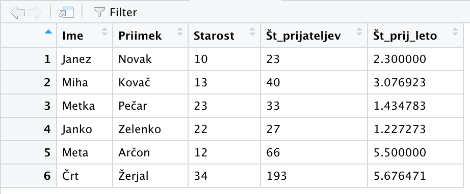

## Branje podatkov {.build}

- Podatke pridobivamo iz različnih virov (tekstovni formati in datoteke, CSV, Excel, splet, podatkovne baze, ...)
- Tipično nas zanimajo tabelarični podatki.
- Oglejmo si razpredelnico v Excelu.
```{r echo=FALSE, out.width='60%'}
knitr::include_graphics('./viri/primer.png')
```

## Branje podatkov {.build}

- Potrebujemo paketa ```readxl``` ter ```openxlsx```.
- ```Tools -> Install packages```
- Nalaganje paketa (podobno ```import <ime_paketa>``` v Pythonu)
```r
> library("readxl")
> library("openxlsx")
```

## Branje podatkov iz Excela {.build}

- Najbolje, da delovno področje nastavimo na mapo, kjer je Excelova datoteka.
- V našem primeru, bo datoteka v podmapi ```viri```.
```r
> podatki <- read_xlsx("viri/primer.xlsx")
> print(podatki)
# A tibble: 6 x 4
  Ime   Priimek Starost Št_prijateljev
  <chr> <chr>     <dbl>          <dbl>
1 Janez Novak        10             23
2 Miha  Kovač        13             40
3 Metka Pečar        23             33
4 Janko Zelenko      22             27
5 Meta  Arčon        12             66
6 Črt   Žerjal       34            193
```

## Branje podatkov iz Excela {.build}

- Lahko podamo tudi specifičen list (ang. sheet) v Excelovi datoteki
```r
> podatki <- read_xlsx("viri/primer.xlsx", sheet="List1")
```

## Dodajanje stolpca {.build}

- Izračunajmo povprečno število prijateljav na leto življenja.
```r
> podatki$Št_prijateljev/podatki$Starost
[1] 2.300000 3.076923 1.434783 1.227273 5.500000 5.676471
```
- Dodajmo rezultat v razpredelnico kot nov stolpec (podobno kot kopiranje formule pri Excelu).
```r
> podatki$Št_prij_leto <-
     podatki$Št_prijateljev/podatki$Starost
> View(podatki)
```
```{r echo=FALSE, out.width='60%'}

```

- namesto ```podatki$ime``` bi lahko pisali ```podatki["ime"]```

## Knjižnica ```dplyr``` {.build}
- Omogoča enostavnejše in preglednejše operacije na razpredelnicah.
- Uvaja operator 'veriženja', ki omogoča preglednejši opis operacij brez gnezdenja funkcij.
- ```f(a, b, ...)``` zapišemo v obliki ```a %>% f(b, ...)```. 
- Rezultat prejšnjega izraza se postavi za prvi argument funkcije naslednjega izraza, ki ga ni potrebno navajati.
- Uvoz
```r
> library(dplyr)
```

## Knjižnica ```dplyr``` {.build}

- Primer
```r
> View(podatki)
> podatki %>% View()
> podatki %>% View
```
- Pozor: funkcije iz paketa ```dplyr``` za delo na razpredelnicah vedno kot prvi argument jemljejo razpredelnico in vedno vračajo novo razpredelnico (ne spreminjajo obstoječe)!
 
## Popravljanje stolpca {.build}

- Popravimo dodani stolpec tako, da ga zaokrožimo na dve decimalki.
```r
> podatki$Št_prijateljev_na_leto <-      
      round(podatki$Št_prijateljev_na_leto, 2)
```
- Stolpec (ali več stolpcev) preberemo kot vektor in ga prepišemo.
- Alternativno z ```dplyr```:
```r
> podatki <- podatki %>% 
   mutate(Št_prij_leto=round(Št_prijateljev/Starost, 2))
```
- Pozor: ```dplyr``` nam olajša delo, saj imena stolpcev preprosto navedemo kot dejanska imena in z njimi lahko neposredno računamo.
- Pomembno: če zapis veriženja napišemo v večih vrsticah, mora biti operator ```%>%``` pred prelomom vrstice.

## Brisanje stolpca {.build}

- Stolpec ```Priimek``` želimo odstraniti.
```r
> priimki <- podatki$Priimek  # shranimo stolpec v vektor
> podatki$Priimek <- NULL
> podatki %>% View
```
- Če v stolpec zapišemo ```NULL```, ga zbrišemo.
- Pozor: če v stolpec zapišemo ```0```, ga nastavimo na vrednost ```0```!
- Z ```dplyr```:
```r
> podatki2 <- podatki %>% select(-Priimek)
```
- Funkcija ```select``` izbere stolpce. Če je stolpec predznačen z ```'-'```, to povzroči odstranjevanje tega stolpca v rezultatu.

## Vstavljanje stolpca {.build}

- Dodajanje/vstavljanje stolpca
```r
> podatki$Priimek <- priimki
> podatki %>% View
```
- Alternativno (```dplyr```)
```r
> podatki2 %>% mutate(Priimek=priimki) 
```
- Stolpec se doda na zadnje mesto.
- Če razpredelnic ne izpisujemo, vrstni red stolpcev načeloma ni važen.

## Preurejanje stolpcev {.build}

- Novo dodani stolpec želimo prestaviti na 2. mesto.
- Preureditev stolpcev izvedemo z operatorjem ```[]``` za podzaporedja, ki pa vrne novo razpredelnico.
```r
> podatki[c(1,5,2,3,4)]
```
- Če želimo preurediti isto razpredelnico, ji priredimo dobljeno razpredelnico.
```r
> podatki <- podatki[c(1,5,2,3,4)]
```

## Izbor določenih stolpcev {.build}

- Z operatorjem za podzaporedja lahko naredimo novo razpredelnico z izbranimi stolpci.
```r
> podatki[c("Ime", "Št_prijateljev")]
```
- Namesto indeksov smo uporabili kar imena stolpcev.
- Alternativno (```dplyr```) lahko uporabimo funkcijo ```select```:
```r
> podatki %>% select(Ime, Št_prijateljev)
```
## Preimenovanje stolpca {.build}

- Stolpec ```Št_prijateljev``` bi radi preimenovali v ```st_prijateljev```.
```r
> names(podatki)[4] <- "st_prijateljev"
> podatki %>% names
[1] "Ime"               "Priimek"           "Starost"               
[4] "st_prijateljev"    "Št_prijateljev_na_leto"
```
- Alternativno (```dplyr```) lahko uporabimo funkcijo ```rename```:
```r
> podatki <- podatki %>% 
    rename(st_prijateljev=Št_prijateljev) 
```

## Filtriranje vrstic {.build}

- Vsi, ki so stari vsaj 15 let.
```r
> podatki[podatki$Starost >= 15, ]
```
- Imena vseh, ki so stari med 15 in 30 let.
```r
> podatki[podatki$Starost >= 15 & podatki$Starost <= 30, 
    c("Ime")]
```
- Alternativno (```dplyr```) lahko uporabimo funkcijo ```filter```:
```r
> podatki %>% filter(Starost >= 15)
> podatki %>% filter(Starost >= 15 & Starost <= 30) %>% 
          select(Ime)
```

## Preurejanje vrstic {.build}

- Kako bi morali urediti indekse, da bi bile vrstice razporejene po starosti?
```r
> podatki$Starost
[1] 10 13 23 22 12 34
> order(podatki$Starost)
[1] 1 5 2 4 3 6
```
- Prerazporejene indekse uporabimo za prerazporeditev v urejen vrstni red.
```r
> novi <- podatki[order(podatki$Starost), ]
```
- Alternativno (```dplyr```) lahko uporabimo funkcijo ```arrange```:
```r
> podatki %>% arrange(Starost)
> podatki %>% arrange(desc(Starost)) # obratni vrstni red
```

## Shranjevanje v Excelovo datoteko {.build}

- Uporabimo knjižnico ```openxlsx```, ter funkcijo ```write.xlsx```.
```r
> library("openxlsx")
> write.xlsx(novi, "viri/primer2.xlsx")
```
```{r echo=FALSE, out.width='60%'}
knitr::include_graphics('./viri/primer2.png')
```

## Shranjevanje v Excelovo datoteko {.build}

- Zaporedje vseh (efektivnih) transformacij lahko s pomočjo veriženja napišemo takole:
```r
read_xlsx("viri/primer.xlsx") %>%
 mutate(Št_prij_leto=round(Št_prijateljev/Starost, 2)) %>%   
 rename(st_prijateljev=Št_prijateljev) %>%   
 arrange(Starost) %>%   
 write.xlsx("viri/primer2.xlsx")
```

## Razmejeni tekstovni format (CSV) {.build}

- Podatke velikokrat dobimo v tekstovni obliki, v razmejenem formatu
    - vsaka vrstica v ločeni vrstici,
    - celice so razmejene s posebnim znakom (ang. delimiter). Tipično je to podpičje, vejica, presledek, tabulator, ...
    - decimalna vejica ali pika,
    - tekstovne celice so v dvojnih navednicah,
    - paziti moramo na kodne tabele (kot pri tekstovnih datotekah v Pythonu),
- CSV (ang. Comma separated values)
    - pogost format,
    - ameriški (separator je vejica, decimalna pika) in evropski (separator je podpičje, decimalna vejica),
    - možen izvoz lista iz Excela
    
## Razmejeni tekstovni format (CSV) {.build}

- Branje - branje - paket ```readr```
    - ```read_delim``` - sami konfiguriramo razmejitveni znak
    - ```read_csv``` - ameriški CSV
    - ```read_csv2``` - evropski CSV
- Ekvivalentne funkcije za pisanje: ```write.table```, ```write.csv```, ```write.csv2```, privzeto vgrajene v R
- Primer: zapis razpredelnice v CSV datoteko v evropskem formatu
```r
> podatki %>% 
    write.csv2("viri/primer2.csv",fileEncoding = "utf8")
```
- Branje:
```r
> prebrani <- read_csv2("viri/primer2.csv") 
> prebrani %>% View
```

