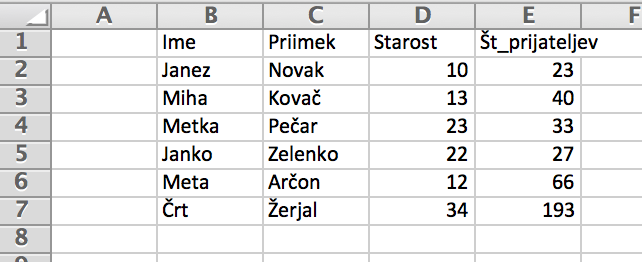
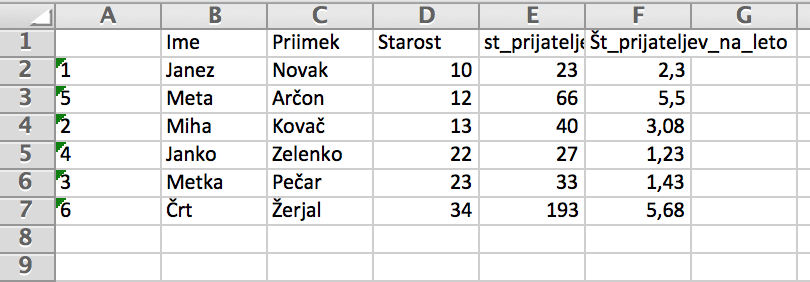

## Branje podatkov

- Podatke pridobivamo iz različnih virov (tekstovni formati in datoteke, CSV, Excel, splet, podatkovne baze)
- Tipično nas zanimajo tabelarični podatki
- Oglejmo si tabeli v Excelu
- 
- Potrebujemo paket ```xlsx```
- ```Tools -> Install packages```
- Nalaganje paketa (podobno ```import ???``` v Pythonu)
-
```r
> require("xlsx")
```

## Branje podatkov iz Excela

- Najbolje, da delovno področje nastavimo na mapo, kjer je Excelova datoteka.
-
```r
> podatki <- read.xlsx(file = "primer.xlsx", sheetName = "Sheet1")
> podatki
    Ime Priimek Starost Št_prijateljev
1 Janez   Novak      10             23
2  Miha   Kovač      13             40
3 Metka   Pečar      23             33
4 Janko Zelenko      22             27
5  Meta   Arčon      12             66
6   Črt  Žerjal      34            193
```

## Dodajanje stolpca {.smaller}

- Izračunajmo povprečno število prijateljav na leto
- 
```r
> podatki$Št_prijateljev/podatki$Starost
[1] 2.300000 3.076923 1.434783 1.227273 5.500000 5.676471
```
- Dodamo v razpredelnico kot nov stolpec (podobno kot formule pri Excelu)
```r
> podatki$Št_prijateljev_na_leto <- podatki$Št_prijateljev/podatki$Starost
> podatki
    Ime Priimek Starost Št_prijateljev Št_prijateljev_na_leto
1 Janez   Novak      10             23               2.300000
2  Miha   Kovač      13             40               3.076923
3 Metka   Pečar      23             33               1.434783
4 Janko Zelenko      22             27               1.227273
5  Meta   Arčon      12             66               5.500000
6   Črt  Žerjal      34            193               5.676471
```
- namesto ```podatki$ime``` bi lahko pisali ```podatki["ime"]```

## Popravljanje stolpca {.smaller}

- Popravimo dodani stolpec tako, da ga zaokrožimo na dve decimalki
- 
```r
> podatki$Št_prijateljev_na_leto <- round(podatki$Št_prijateljev_na_leto, digits = 2)
> podatki
    Ime Priimek Starost Št_prijateljev Št_prijateljev_na_leto
1 Janez   Novak      10             23                   2.30
2  Miha   Kovač      13             40                   3.08
3 Metka   Pečar      23             33                   1.43
4 Janko Zelenko      22             27                   1.23
5  Meta   Arčon      12             66                   5.50
6   Črt  Žerjal      34            193                   5.68
```
- Stolpec (ali več stolpcev) preberemo kot vektor in ga prepišemo
- Funkcije se tudi aplicirajo vektorsko 

## Brisanje stolpca

- Stolpec ```Priimek``` želimo odstraniti
-
```r
> priimki <- podatki$Priimek
> podatki$Priimek <- NULL
> podatki
    Ime Starost Št_prijateljev Št_prijateljev_na_leto
1 Janez      10             23                   2.30
2  Miha      13             40                   3.08
3 Metka      23             33                   1.43
4 Janko      22             27                   1.23
5  Meta      12             66                   5.50
6   Črt      34            193                   5.68
```
- Če v stolpec zapišemo ```NULL``` ga zbrišemo.
- Če v stolpec zapišemo ```0``` ga nastavimo na vrednost ```0```

## Vstavljanje stolpca

- Stolpec dodamo in stolpce preuredimo
- 
```r
> podatki$Priimek <- priimki
> podatki
    Ime Starost Št_prijateljev Št_prijateljev_na_leto Priimek
1 Janez      10             23                   2.30   Novak
2  Miha      13             40                   3.08   Kovač
3 Metka      23             33                   1.43   Pečar
4 Janko      22             27                   1.23 Zelenko
5  Meta      12             66                   5.50   Arčon
6   Črt      34            193                   5.68  Žerjal
```
- Po vstavljanju lahko stolpce preuredimo

## Preurejanje stolpcev

- Novo dodani stolpec želimo prestaviti na 2. mesto
- Preureditev stolpcev izvedemo z operatorjem ```[]```za podzaporedja
-
```r
> podatki[c(1,5,2,3,4)]
    Ime Priimek Starost Št_prijateljev Št_prijateljev_na_leto
1 Janez   Novak      10             23                   2.30
2  Miha   Kovač      13             40                   3.08
3 Metka   Pečar      23             33                   1.43
4 Janko Zelenko      22             27                   1.23
5  Meta   Arčon      12             66                   5.50
6   Črt  Žerjal      34            193                   5.68
```
- Če želimo preurediti isto razpredelnico, ji priredimo predelano
- 
```r
> podatki <- podatki[c(1,5,2,3,4)]
```

## Izbor določenih stolpcev

- Z operatorjem za podzaporedja lahko naredimo razpredelnico z izbranimi stolpci
-
```r
> podatki[c("Ime", "Št_prijateljev")]
    Ime Št_prijateljev
1 Janez             23
2  Miha             40
3 Metka             33
4 Janko             27
5  Meta             66
6   Črt            193
```
- Namesto indeksov smo uporabili kar imena stolpcev

## Preimenovanje stolpca {.smaller}

- Stolpec ```Št_prijateljev``` bi radi preimenovali v ```st_prijateljev```
-
```r
> names(podatki)[4] <- "st_prijateljev"
> names(podatki)
[1] "Ime"                    "Priimek"                "Starost"               
[4] "st_prijateljev"         "Št_prijateljev_na_leto"
```
- Alternativno preko logičnega indeksa
```r
> names(podatki) == "Št_prijateljev"
[1] FALSE FALSE FALSE  TRUE FALSE
> names(podatki)[names(podatki) == "Št_prijateljev"] <- "st_prijateljev"
```

## Filtriranje vrstic {.smaller}

- vsi, ki so stari vsaj 15 let
- 
```r
> podatki[podatki$Starost >= 15, ]
    Ime Priimek Starost st_prijateljev Št_prijateljev_na_leto
3 Metka   Pečar      23             33                   1.43
4 Janko Zelenko      22             27                   1.23
6   Črt  Žerjal      34            193                   5.68
```
- imena vseh, ki so stari med 15 in 30 let
- 
```r
> podatki[podatki$Starost >= 15 & podatki$Starost <= 30, c("Ime")]
[1] Metka Janko
Levels: Črt Janez Janko Meta Metka Miha
```
- 
```r
> podatki$Starost >= 15
[1] FALSE FALSE  TRUE  TRUE FALSE  TRUE
> which(podatki$Starost >= 15)
[1] 3 4 6
```

## Preurejanje vrstic

- Kako bi morali urediti indekse, da bi bile vrstice razporejene po starosti?
- 
```r
> podatki$Starost
[1] 10 13 23 22 12 34
> order(podatki$Starost)
[1] 1 5 2 4 3 6
```
- Urejene indekse uporabimo za prerazporeditev.
- 
```r
> novi <- podatki[order(podatki$Starost), ]
> novi
    Ime Priimek Starost st_prijateljev Št_prijateljev_na_leto
1 Janez   Novak      10             23                   2.30
5  Meta   Arčon      12             66                   5.50
2  Miha   Kovač      13             40                   3.08
4 Janko Zelenko      22             27                   1.23
3 Metka   Pečar      23             33                   1.43
6   Črt  Žerjal      34            193                   5.68
```

## Shranjevanje v Excelovo datoteko

- 
```r
> write.xlsx(novi, "primer2.xlsx")
```
- 
- Če želimo brez oštevilčenja vrstic
-
```r
> write.xlsx(novi, "primer2.xlsx",row.names = FALSE)
```

## Tekstovni formati {.smaller}

- Podatke velikokrat dobimo v tekstovni obliki, v razmejenem formatu
    - vsaka vrstica v ločeni vrstici
    - celice so razmejene s posebnim znakom (ang. delimiter). Tipično je to podpičje, vejica, presledek, tabulator, ...
    - decimalna vejica ali pika?
    - tekstovne celice so v dvojnih navednicah
    - paziti moramo na kodne tabele (kot pri tekstovnih datotekah v Pythonu)
- CSV (ang. Comma separated values)
    - pogost format
    - ameriški (separator je vejica, decimalna pika) in evropski (separator je podpičje, decimalna vejica)
    - možen izvoz lista iz Excela
- funkcije:
    - ```read.table``` - sami konfiguriramo razmejitveni znak
    - ```read.csv``` - ameriški CSV
    - ```read.csv2``` - evropski CSV
   
## Tekstovni formati {.smaller}

- Ekvivalentne funkcije za pisanje: ```write.table```, ```write.csv```, ```write.csv2```
- Dodatne opcije (pomoč vedno prikličemo z ```help(ukaz)```)
- ```sep``` - znak za separator. Če ```""```` je to beli znak.
- ```header````- ```TRUE/FALSE``` - ali ima tabela prvo vrstico, ki je glava
- ```quote``` - znak za navednice, privzeto ```"```
- ```dec``` - znak za decimalno piko
- ```row.names``` - vektor imen vrstic oz. indeks stolpca, ki naj se uporabi kot niz
- ```col.names``` - imena stolpcev. Privzeto ```V[indeks]```
- ```as.is```- določanje tipa tekstovnih stolpcev (privzeto je to ```factor```
- ```colClasses``` - tip se ponavadi sam določa, lahko pa podamo vektor tipov po stolpcih
- ```na.strings``` - kateri niz določa prazna polja 
- ```skip``` - koliko vrstic izpustimo na začetku
- ```nrow``` - koliko zaporednih vrstic sploh preberemo
- ```encoding```- kodna tabela (ponavadi se sama določi, lahko npr. ```"UTF-8"```)

## Datoteke iz statističnega urada

- http://www.stat.si/
- Npr. ```Izobraževanje```, zavihek ```Podatki```, ```Podrobne tabele```
- Gremo v globino, npr. ```Vpisani v visokošolsko izobraževanje Podatki v PC-Axis formatu```, izberemo prvo možnost
- http://pxweb.stat.si/pxweb/Dialog/varval.asp?ma=0955201s&ti=&path=../Database/Dem_soc/09_izobrazevanje/08_terciarno_izobraz/01_09552_vpisani_dodiplomska/&lang=2
- Nastavimo filtre, način prikaza tabele (izvoza) kot ```Razmejena datoteka z glavo .csv```, npr. povsod ```Izberi vse````
- Gumb ```Izpis podatkov````
- Dobimo datoteko v dokaj zapleteni obliki. 