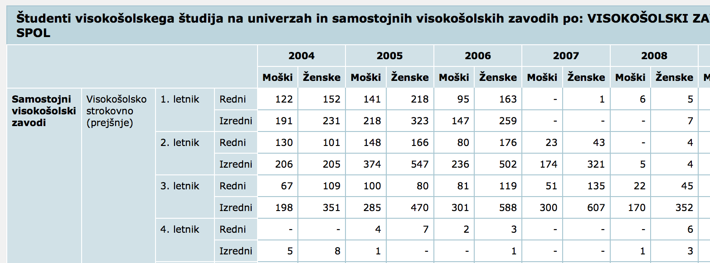
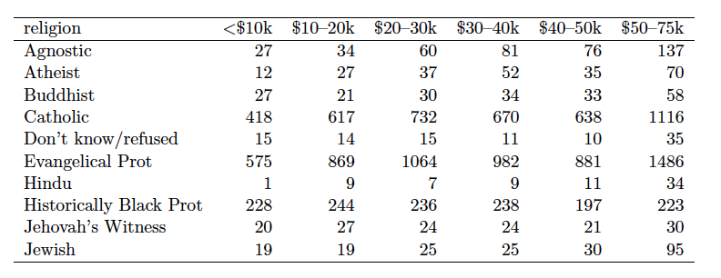
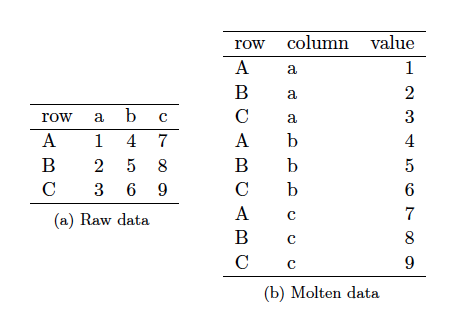
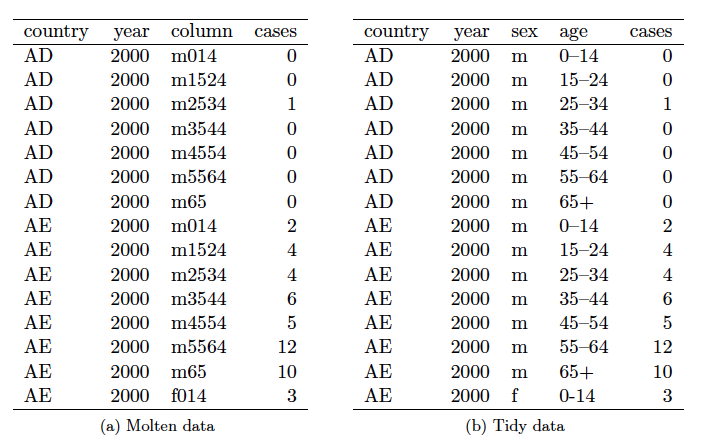
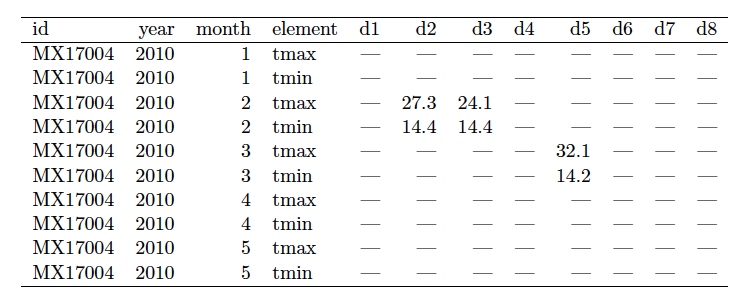
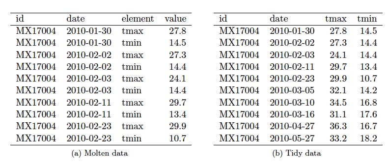
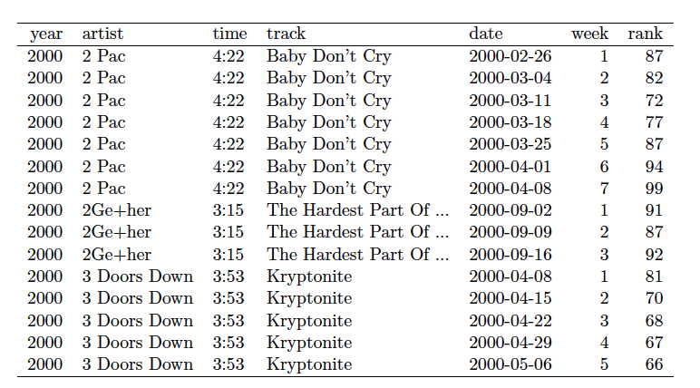
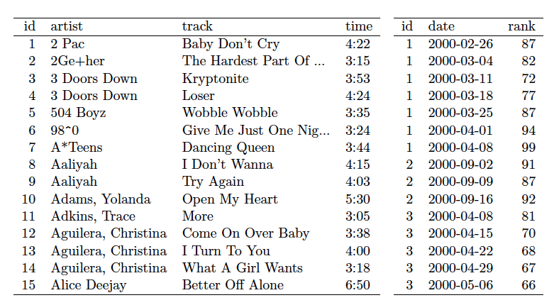

## Datoteke iz statističnega urada {.smaller}

- http://www.stat.si/
- Npr. ```Izobraževanje```, zavihek ```Podatki```, ```Podrobne tabele```
- Gremo v globino, npr. ```Vpisani v visokošolsko izobraževanje```, izberemo prvo možnost
- http://pxweb.stat.si/pxweb/Dialog/varval.asp?ma=0955201s&ti=&path=../Database/Dem_soc/09_izobrazevanje/08_terciarno_izobraz/01_09552_vpisani_dodiplomska/&lang=2
- Nastavimo filtre, način prikaza tabele (izvoza) kot ```Prikaz tabele na zaslonu```, za vsak tip podatka izberemo vse možnosti, razen tistih, ki so sumarne (v imenu je ```SKUPAJ```)
- Gumb ```Izpis podatkov```
- Podatki se prikažejo kot tabela na zaslonu

## Tabele s hierarhičnimi indeksi {.smaller}

- Privzet prikaz tabele je s hieararhičnimi indeksi
- 
- S hierarhičnimi indeksi je težko delati
- R nima dobre podpore (npr. Python Pandas ima)

## "Navadne tabele" {.smaller}

- Bolj smiselno bi bilo imeti podatke v obliki tabele s stolpci:
    - VISOKOŠOLSKI ZAVOD
    - VRSTA IZOBRAŽEVANJA
    - LETNIK
    - NAČIN ŠTUDIJA
    - SPOL
    - ŠTUDIJSKO LETO
    - ST_STUDENTOV
- Na takih tabelah obstaja t.i. "Relacijska algebra", ki je osnova za delo s tabelami v podatkovnih bazah
- Dobra podpora teorije in funkcij za izvajanje operacij

## Obdelava in pridobivanje podatkov {.smaller}

- Ročno "zavrtimo" tabelo
- Izvozimo v obliki "Razmejena datoteka z glavo .csv"
- Ogledamo si format CSV v tekstovni datoteki
- Ogledamo si še datoteko v Excelu
- Prve 4 vrstice so nepomembne
- Tabela nima glave
- Vsebina v prvih nekaj stolpcih je še vedno podana hierarhično
- Nimamo glave tabele
- Prazna polja so označena kot "-"
- Definirajmo imena stolpcev
- 
```r
> stolpci <- c("VISOKOŠOLSKI ZAVOD", "VRSTA IZOBRAŽEVANJA", "LETNIK", 
"NAČIN ŠTUDIJA", "ŠTUDIJSKO LETO", "SPOL", "ST_STUDENTOV")
```

## Branje tabele

- Izpustiti moramo prve 4 vrstice
- Prebrati moramo do vključno vrstice 7166
- Nimamo glav tabele (ang. header)
- Določiti moramo imena stolpcev, da se datoteka pravilno prebere
- Prazna polja: presledki, "-", ...
-
```r
> podatki <- read.csv2(file = "viri//0955201ss.csv", skip=4, 
nrow=(7166-4), header=FALSE, strip.white=TRUE, col.names=stolpci, 
fileEncoding="cp1250")
```

## Obdelava podatkov {.smaller}

- Nadomeščanje presledkov z ```NA```
-
```r
> podatki$VISOKOSOLSKI_ZAVOD[podatki$VISOKOSOLSKI_ZAVOD == " "] <- NA
```
- Oziroma:
```r
> podatki[["VISOKOSOLSKI_ZAVOD"]][podatki[[VISOKOSOLSKI_ZAVOD]] == " "] <- NA
```

- Dan je vektor z redkimi vrednostmi, vmes ```NA```
- Vmesne vrednosti želimo dopolniti z zadnjo ne-```NA``` vrednostjo
- Paket ```zoo```, funkcija ```na.locf```
-
```r
> require(zoo)
> podatki[["VISOKOSOLSKI_ZAVOD"]] <- na.locf(podatki[["VISOKOSOLSKI_ZAVOD"]])
```

## Obdelava podatkov {.smaller}

- Ponovimo "vajo" za prvih 5 stolpcev
-
```r
for (ime in stolpci[c(-6,-7)]) {
        podatki[[ime]][podatki[ime] == " "] <- NA;
        podatki[[ime]] <- na.locf(podatki[[ime]]);
}
```
- Zaradi "čudnega" formata tabele, je potrebno odstraniti določene vrstice
- Odstrani vrstice z ```NA``` v stolpcu ```STUDIJSKO_LETO```
-
```r
> tabela <- podatki[!is.na(podatki$STUDIJSKO_LETO),]
```
- Nadomesti nize "-" z ```NA``` v stolpcu ```ST_STUDENTOV```
-
```r
> tabela$ST_STUDENTOV[tabela$ST_STUDENTOV == "-"] <- NA
```
- Pretvori stolpec ```ST_STUDENTOV``` v ```integer```
-
```r
> tabela$ST_STUDENTOV <- as.integer(tabela$ST_STUDENTOV)
```

## Relacijski model

- Podatke organiziramo kot množico večih tabel (```data.frame```-ov) 
- Model je v osnovi star več kot 35 let
- Uporablja se v večini večjih poslovnih sistemov, relacijskih podatkovnih bazah
- Enostaven za razumevanje, pregleden
- Omogoča zmogljive poizvedbe v standardiziranem jeziku SQL (na podatkovnih bazah) in podobno zmogljive poizvedbe/operacije v R
- Podpira učinkovite implementacije (pri podatkovnih bazah in v R)

## Relacijska algebra 

- Podatke organiziramo kot množico večih tabel (```data.frame```-ov) 
- *Relacija* = tabela
- *Relacijska algebra* je matematični opis operacij nad relacijami (tabelami).
- Operatorji so operacije, ki sprejmejo relacije (tabele) in vrnejo (nove) relacije (tabele).
- *Shema relacije* = definicija tabele (imena + tipi).

## Operatorji relacijske algebre {.smaller}
- Operatorji so odvisni od shem relacij nad katerimi jih izvajamo.
- $\sigma_{p}(R)$ - izberi vrstice v relaciji $R$, ki ustrezajo pogoju $p$.    
    - Pogoj je lahko logični izraz. 
    - Shema vrnjene tabele je ista.
    - Primer: operator ```[pogoj,]``` v kombinaciji z logičnim indeksom
- $\pi_{a_1, a_2, \ldots, a_n}(R)$ - izberi stolpce z imeni $a_1, a_2, \ldots, a_n$ relacije $R$ in vrni novo tabelo s shemo, ki jo določajo definicije teh stolpcev. 
    - Število vrstic ostane nespremenjeno.
    - Primer: operator ```[vektor_imen]```
- $\rho_{a/b}(R)$ - spremeni ime stolpcu $a$ v $b$. Vrni enako tabelo (glede vrstic), le z drugo shemo.
    - Primer: preimenovanje stolpca preko ```names(df)[[ime]] <- novo_ime```
    
## Operatorji relacijske algebre {.smaller}

- $R \cup S$ - vrni relacijo z unijo vrstic, če imata relaciji $R$ in $S$ enaki shemi.
- $R \setminus S$ - vrni relacijo z razliko vrstic, če imata relaciji $R$ in $S$ enaki shemi.
- $R \times S$ - vrni kartezični produkt relacij (vsaka vrstica $R$ z vsako vrstico $S$). 
     - Shema rezultata sta združeni shemi.
     - Ni tako uporabna operacija, so pa uporabne ustrezne učinkovite izvedbe s filtriranjem (združitve)

## Operacija JOIN 

$R \bowtie S = \pi_{\scriptsize shema(R) \cup shema(S)}( \sigma_{\scriptsize R.a_1 = S.a_1 \land R.a_2 = R.a_2 \land \ldots}(R \times S))$


<font size="2px"> Vir: Wikipedia. </font>

## Paket *dplyr* {.smaller}

- Podpira operacije iz relacijske algebre
- Učinkovita implementacija
- Alternativa: uporaba paketa ```data.table```
- https://cran.rstudio.com/web/packages/dplyr/vignettes/introduction.html
- https://cran.r-project.org/web/packages/dplyr/vignettes/two-table.html

## Operatorji v *dplyr* {.smaller}

- Osnovni relacijski operatorji:
    - ```filter(p)``` - $\sigma_{p}(R)$
    - ```select(a_1, a_2, ..., a_n)``` - $\pi_{a_1, a_2, \ldots, a_n}(R)$
    - ```rename()``` - $\rho_{a/b}(R)$
    - ```union(x, y)``` - $R \cup S$
    - ```setdiff(x, y)``` - $R \setminus S$
    - ```inner_join(x, y)``` - združitev po skupnih stolpcih 
- Dodatni praktično uporabni operatorji
    - ```arrange(...)``` - urejanje vrstic glede na izbrane stolpce
    - ```mutate(...)``` - preimenovanje stolpcev in dodajanje novih, ki so funkcije obstoječih.
    - ```distinct()``` - ohranjanje enoličnih vrstic
    - ```summarize(...)``` - uporaba združevalne funkcije na nekem stolpcu
    - ```group_by(...)```  - združevanje po vrsticah glede na enake vrednosti v stolpcih

## Popravljanje stolpca ```LETNIK``` {.smaller}

- Obstoječa imena v stolpcu ```LETNIK``` 
-
```r
> imena <- c("1. letnik", "2. letnik", "3. letnik", 
"4. letnik", "5. letnik", "6. letnik", "Absolventi")
```
- Radi bi jih poenostavili imena v:
-
```r
> letniki <- c("1","2","3","4","5","6","Abs")
```
- Ustvarimo "relacijo" s temi dvemi stolpci
-
```r
> tab2 <- data.frame(letnik=letniki, ime=imena)
> tab2$ime <- as.character(tab2$ime)
```
- Uporabimo operacijo ```inner_join``` po stolpcih ```LETNIK``` IN ```ime```
-
```r
> require(dplyr)
> zdruzena <- inner_join(tabela, tab2, c("LETNIK"="ime"))
```

## Poizvedbe {.smaller}

- Uporabi operacije iz relacijske algebre pravimo *poizvedba*
- Ime izhaja iz relacijskih podatkovnih baz in jezika SQL, ki izvaja operacije in iz obstoječih tabel (relacij) preko operacij proizvajajo nove tabele (relacije)
- Vrni tabelo z vrsticami, ki pripadajo ženskam
- 
```r
> filter(zdruzena, SPOL=="Ženske")
```
- Ekvivalentno opratorju ```[pogoj,]```
- Vse vrstice, v katerih so ženske vpisane po letu 2011
-
```r
> filter(zdruzena, SPOL=="Ženske" & STUDIJSKO_LETO > 2011)
```
- Namesto operatorja "&" lahko pogoje ločimo z vejico
```r
> filter(zdruzena, SPOL=="Ženske", STUDIJSKO_LETO > 2011)
```

## Operacija ```arrange```

- Uredi po stolpcu ```ST_STUDENTOV```
- 
```r
> arrange(zdruzena, ST_STUDENTOV)
```
- Uredi po stolpcih ```STUDIJSKO_LETO``` in potem po stolpcu ```ST_STUDENTOV```, in sicer padajoče
-
```r
> arrange(zdruzena, STUDIJSKO_LETO, desc(ST_STUDENTOV))
```

## Operaciji ```select``` in ```rename```

- Izberi samo stolpce ```STUDIJSKO_LETO```, ```ST_STUDENTOV``` in ```SPOL``` 
-
```r
> select(zdruzena, STUDIJSKO_LETO, ST_STUDENTOV, SPOL)
```
- Ob tem še preimenuj stolpec ```STUDIJSKO_LETO``` v ```LETO```.
-
```r
> select(zdruzena, LETO=STUDIJSKO_LETO, ST_STUDENTOV, SPOL)
```
- Preimenuj stolpec ```STUDIJSKO_LETO``` v ```LETO```
-
```r
> rename(zdruzena, LETO=STUDIJSKO_LETO)
```

## Združevanje po vrsticah {.smaller}

- Za katera leta imamo podatke?
-
```r
> zdruzena %>% select(STUDIJSKO_LETO) %>% distinct()
```
- Operator ```%>%``` iz paketa ```dplyr``` nam omogoča "pythonovske" klice kot za metode in s tem veriženje operacij (poveča preglednost kode)
- Koliko študentov je bilo vpisanih vsako leto?
-
```r
> zdruzena %>% 
    group_by(STUDIJSKO_LETO) %>% 
    summarize(VPIS=sum(ST_STUDENTOV, na.rm=TRUE))
```
- Najprej smo združili vrstice po istih vrednostih v stolpcu ```STUDIJSKO_LETO```, potem pa uporabili združevalno funkcijo na nekem od preostalih stolpcev.
- V rezultatu so le smiselni stolpci.
- Združevalne funkcije: ```min(x)```, ```max(x)```, ```mean(x)```, ```sum(x)```, ```sd(x)```, ```median(x)```, ```IQR(x)```, ```n(x)```, ```n_distinct(x)```, ```first(x)```, ```last(x)``` in ```nth(x, n)```


## Združevanje {.smaller}

- Koliko je bilo vpisanih po spolih za posamezna leta?
-
```r
> zdruzena %>% 
    group_by(SPOL, STUDIJSKO_LETO) %>% 
    summarize(VPIS=sum(ST_STUDENTOV, na.rm=TRUE))
```
- Koliko žensk in koliko moških je bilo vpisanih na posameznih vrstah študija na univerzi?
-
```r
> tmp1 <- zdruzena %>% 
   filter(VISOKOSOLSKI_ZAVOD == "Univerze - SKUPAJ") %>%
   select(VRSTA_IZOBRAZEVANJA, SPOL, ST_STUDENTOV) 
```

## Združevanje {.smaller}

- Grupiramo in seštejemo za moške.
-
```r
> tmp2 <- tmp1 %>% 
   filter(SPOL=="Moški") %>% 
   group_by(VRSTA_IZOBRAZEVANJA) %>%
   summarize(Moški=sum(ST_STUDENTOV, na.rm=TRUE))
```
- Grupiramo in seštejemo za ženske.
-
```r
> tmp3 <- tmp1 %>% 
  filter(SPOL=="Ženske") %>% 
  group_by(VRSTA_IZOBRAZEVANJA) %>%
  summarize(Ženske=sum(ST_STUDENTOV, na.rm=TRUE))
```
- Povežemo obe tabeli preko združitve (join)
-
```r
> tmp4 <- tmp2 %>% 
        left_join(tmp3) %>%
        select(VRSTA_IZOBRAZEVANJA, Moški, Ženske) %>%
        arrange(VRSTA_IZOBRAZEVANJA) %>%
        mutate(faktor=round(Ženske/Moški, 2))
```

## Organizacija podatkov

- Podatke si skušamo organizirati v obliko, ki se ji reče <a href="https://cran.r-project.org/web/packages/tidyr/vignettes/tidy-data.html">Tidy data</a>
- Paketa ```dplyr``` in ```ggplot2``` (za vizualizacijo) sta še posebej prilagojena za to vrstno obliko podatkov
- Taka organizacija podatkov je povezana s t.i. *normalizacijo relacij* pri relacijskih podatkovnih bazah in v relacijski algebri

## Normalizacija

- *Normalizacija* je proces v katerem sistematično pregledamo relacije (tabele) in anomalije. Ko identificiramo anomalijo relacijo razbijemo na dve novi.
- Med procesom normalizacije ponavadi dobimo še globji vpogled, kakšna bo interakcija med podatki v različnih tabelah.
- Normalizacija nam pomaga odstraniti redundantnost zapisa podatkov.
- Ampak zato moramo morda delati več `join`-ov.
- Včasih se zaradi učinkovitosti namerno odločimo, da ne izvedemo nekega koraka normalizacije (npr. za namene določenih hitrih analiz).


## Funkcijska odvisnost

- *Funkcijska odvisnost* opisuje odnos med stolpci znotraj iste relacije (tabele).
- Stolpec je funkcijsko odvisen od drugega, če lahko s pomočjo vrednosti prvega stolpca v neki vrstici impliciramo vrednost drugega stolpca v isti vrstici.
- Primer: Številka študenta implicira študij študenta.
- Za nakazovanje funkcijske odvisnosti uporabimo simbol `->`
- Stolpec je lahko funkcijsko odvisen od kombinacije večih stolpcev.
- Primer: `Solsko_leto, Predmet -> Predavatelj`

## Ključ

- Ključ: eden ali več stolpcev, ki enolično določajo vrstico.
- Izbor ključev temelji na konkretni aplikaciji baze. Kaj je ključ izvemo velikokrat iz konteksta in od uporabnikov.
- Za ključ vedno velja: `Ključ -> vsi ostali stolpci`.
- Obstajajo lahko funkcijske odvisnosti, ki na levi strani nimajo (samo) ključev.
- Kaj z njimi?

## Vrste normalizacij

- Vrste:
    - Prva normalizirana oblika (1NF)
    - Druga normalizirana oblika (2NF)
    - Tretja normalizirana oblika (3NF)
    - Boyce-Codd normalizirana  (BCNF)
    - Četrta normalizirana oblika (4NF)
    - Peta normalizirana oblika (5NF)
- Vsaka naslednja oblika vsebuje prejšnjo.

## Normalizacija

Normalizacija v ustrezno obliko poteka na naslednji način:

- Določimo ključe vsake relacije (tabele).
- Določimo funkcijske odvisnosti.
- Preverimo ali so kršene zahteve ustrezne definicije.
- Če pride do kršitve v neki relaciji, potem to relacijo (tabelo) razdelimo na dve relaciji.
- Ponovno preverimo pogoje za izbrano obliko.

## 1NF = predpostavke za relacijo

- Pogoji:
    - Vsaka vrstica ima za določen stolpec samo eno vrednost. 
    - Podatki v stolpcu so istega tipa.
    - Isto ime stolpca se lahko pojavi le enkrat v relaciji.
    - Vrstni red stolpcev ni važen.
    - Nobeni dve vrstici ne smeta biti enaki.
    - Vrstni red vrstic ni važen.

## <a href="http://holowczak.com/database-normalization/6/">2NF</a>{.smaller}

- Ključ (ang. superkey): katera koli skupina stolpcev, za katere ne obstajata dve vrstici z istima vrednostima v teh stolpcih. Vsi drugi stolpci so funkcijsko odvisni od stolpcev, ki določajo ključ. 
- 1NF - vsi stolpci skupaj določajo nek ključ
- Minimalni ključ (ang. candidate key): ključ, za katerega nobena stroga podmnožica ne predstavlja ključa.
- Primarni ključ: izbrani minimalni ključ
- Neključni stolpec: stolpec, ki ni v nobenem minimalnem ključu
- Pogoj za 2NF: 1NF + nobena stroga množica kakega minimalnega ključa ne funkcijsko določa kak neključni stolpec
-
<table
<tr><td>

</td><td>

</td></tr></table>

## <a href="http://holowczak.com/database-normalization/7/">3NF </a>

- Pogoj: relacija je v 2NF in nimamo tranzitivnih funkcionalnih odvisnosti.
- Tranzitivna funkcionalna odvisnost: 
    - iz `A -> B`, `B -> C` sledi `A -> C`.
-
<table
<tr><td>

</td><td>

</td></tr></table>

## <a href="http://holowczak.com/database-normalization/8/">BCNF</a>

- Pogoj: za vsako funkcionalno odvisnost oblike:
     - `A1, ..., An -> B` velja, 
     - da stolpci `A1, ..., An` predstavljajo primarni ključ.

## "Statistična" definicija "tidy data"

- Stolpci so lahko spremenljivke ali meritve
- Spremenljivke opisujejo parametre pri katerih je izvedene meritev
- Definicija "Tidy data"
    - vsaka spremenljivka tvori stolpec
    - za vsako meritev imamo eno vrstico
    - vsak tip meritve je v ločeni tabeli
- Ekvivalentno: podatki so v 3NF    
    
## Najbolj pogosti problemi

- Imena stolpcev so vrednosti, ne pa imena spremenljivk
- V enem stolpcu hranimo več spremenljivk
- Spremenljivke hranimo tako v vrsticah kot v stolpcih
- Več vrst meritev (podatkov) v eni tabeli
- Več istovrstnih meritev v večih tabelah
- Hadley Wickham, <a href="http://www.jstatsoft.org/article/view/v059i10/v59i10.pdf">Tidy Data</a>, Journal of Statistical Software, August 2014, Volume 59, Issue 10

## Imena stolpcev s vrednosti

-

-


## Operacija "melt" {.smaller}

- paket ```reshape2```
- 
```{r}
head(airquality)
```
-
```{r echo=FALSE, warning=FALSE}
require(reshape2)
```
-
```{r}
head(melt(airquality, id.vars = c("Month", "Day")))
```

## En stolpec več spremenljivk

-

- Obdelavo nizov si bomo ogledali kasneje (regularni izrazi)

## Spremenljivke v vrsticah in stolpcih

-

-


## Več vrst meritev v eni tabeli

-

- Normalizacija
-


## Več istovrstnih meritev v večih tabelah

- Npr. meritve za vsako leto, po osebah, ...
- Po potrebi dodamo stolpce, ki odražajo delitev in združimo v eno tabelo
- Npr. delitev po letih: dodamo stolpec leto